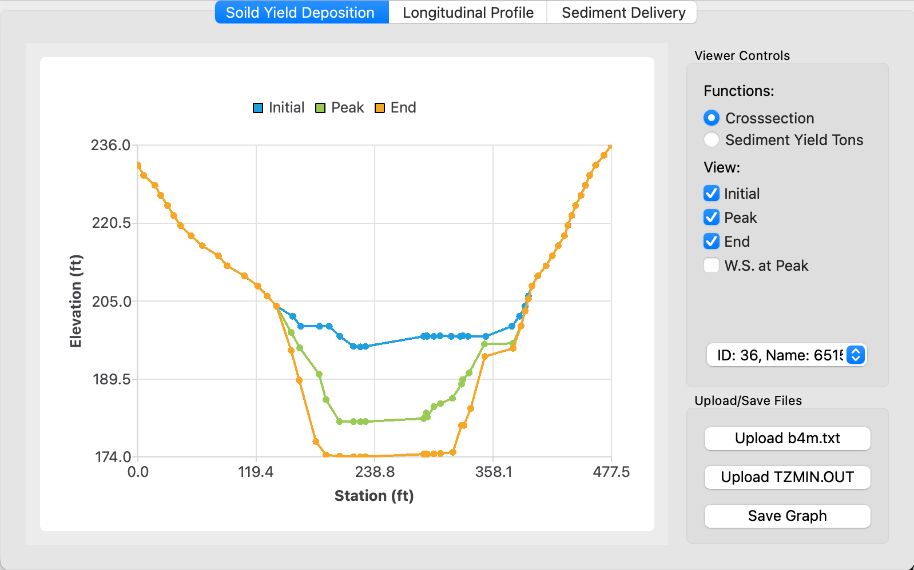

# FLUVIAL-12 Visualizer

The purpose of this repository is to visualize the output of the [FLUVIAL-12](https://advancedengineeringsoftware.com/wp/fluvial/) model. This program enables users to easily view hydrograph data from various files from the FLUVIAL-12 model. 

<p align="center">
    
</p>

## Dependencies
* [cmake](https://cmake.org/download/)
* [Qt](https://www.qt.io/product/framework)

## Build from Source

1. Clone the project

```bash
  git clone https://github.com/StevenChang5/cross-section_visualizer.git
```

2. Build using cmake
```bash
  cmake -B build
  cmake --build build
```

3. Run the generated executable
```bash
  cd build && ./main
```